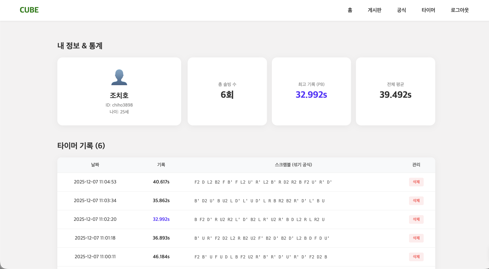
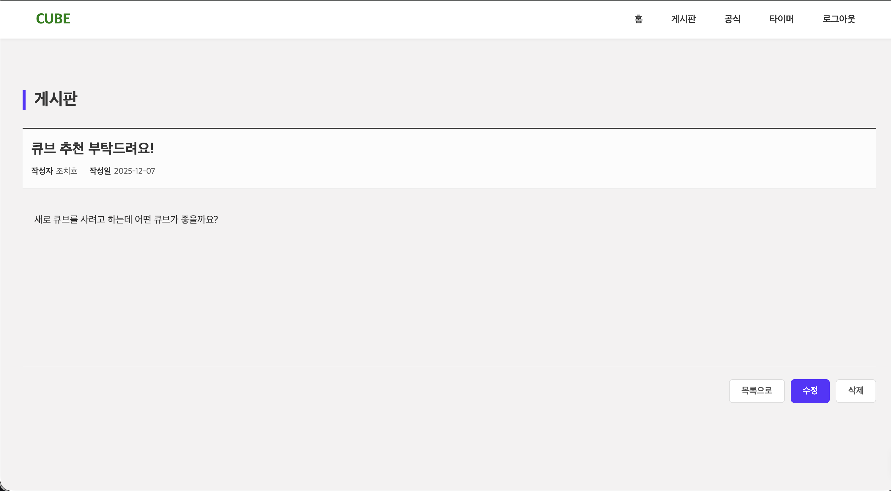
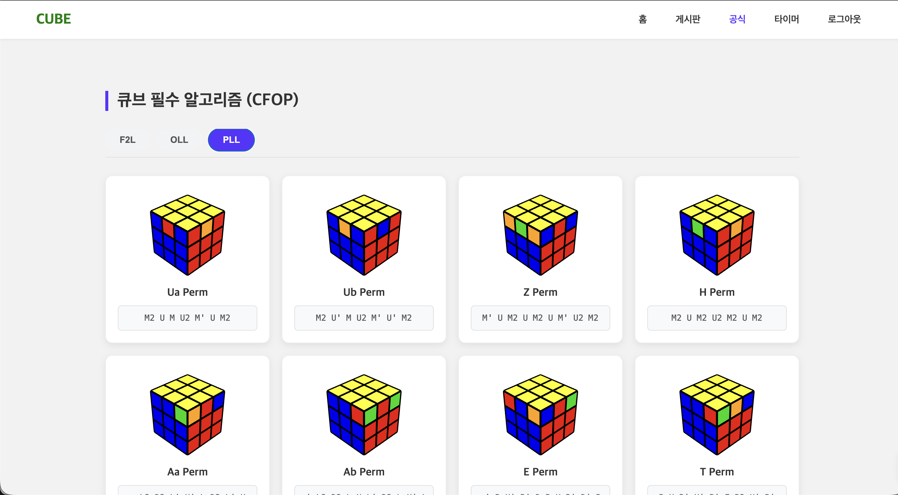

# 🧩 Cubing Hub (큐빙 허브)

<div align="center">
  
  <br />
  <br />
  
  
  
  
  
  

  <p align="center">
    <b>큐브 스피드솔빙을 위한 올인원 유틸리티 플랫폼</b><br />
    타이머, 기록 분석, 알고리즘 학습, 그리고 커뮤니티를 하나로 통합했습니다.
  </p>
</div>

---

## 📖 프로젝트 소개 (About The Project)

**"큐브 기록은 여기서, 알고리즘은 저기서... 왜 따로 관리해야 할까?"**

**Cubing Hub**는 파편화된 큐브 관련 기능들을 하나의 웹 서비스로 통합하여 사용자에게 끊김 없는(Seamless) 경험을 제공하기 위해 개발되었습니다. 
정밀한 타이머 측정부터 3D 알고리즘 시각화, 그리고 노하우를 공유하는 커뮤니티까지 큐버들에게 필요한 모든 도구를 제공합니다.

## ✨ 주요 기능 (Key Features)

### ⏱️ 1. 스마트 큐브 타이머 (Smart Timer)
- **스택매트(Stackmat) UX**: 스페이스바를 누르고(Ready) 떼는 순간(Start) 시작되는 직관적인 타이머
- **정밀 측정**: `Date.now()` 기반의 Delta Time 계산으로 프레임 드랍 없는 정확한 시간 측정
- **랜덤 스크램블**: WCA 공식 규격에 준하는 3x3 큐브 섞기 공식 자동 생성

### 📊 2. 대시보드 & 통계 (Dashboard)
- **개인 기록 관리**: 날짜별 솔빙 기록 자동 저장 및 조회
- **실시간 통계**: 전체 평균(Mean), 최고 기록(PB), 총 솔빙 횟수 실시간 분석
- **데이터 시각화**: 내 성장 과정을 한눈에 볼 수 있는 직관적인 UI

### 📚 3. 알고리즘 라이브러리 (Algorithm Visualizer)
- **3D 시각화**: 텍스트 공식만으로는 이해하기 힘든 큐브 회전을 **VisualCube API**를 통해 3D 이미지로 제공
- **단계별 학습**: 초급자용(LBL)부터 전문가용(CFOP - F2L, OLL, PLL)까지 체계적인 분류

### 🗣️ 4. 커뮤니티 (Community)
- **정보 공유**: 큐브 추천, 관리법, 솔빙 팁을 공유하는 자유 게시판
- **CRUD**: 게시글 작성, 조회, 수정, 삭제 기능 완벽 구현

---

## 🛠️ 기술 스택 (Tech Stack)

| Category | Technology |
| :--- | :--- |
| **Frontend** | React (Vite), JavaScript (ES6+) |
| **State Management** | Zustand (Global Store) |
| **Styling** | Styled-Components |
|           ㅤ    |                 |
| **Backend** | Spring Boot 3.4, Java 17 |
| **Database** | H2 (Dev), MySQL (Prod), Spring Data JPA |
| **External API** | VisualCube API (3D Rendering) |

---

## 📸 스크린샷 (Screenshots)

| **메인 대시보드 & 통계** | **타이머** |
| :---: | :---: |
|  |  |
| **게시판 (커뮤니티)** | **알고리즘 라이브러리** |
|  |  |

---

## 🚀 시작하기 (Getting Started)

이 프로젝트는 **Frontend(React)** 와 **Backend(Spring Boot)** 가 통합된 모노레포 구조입니다.

### 1. 설치 (Installation)
```bash
# 레포지토리 클론
git clone https://github.com/xxh3898/cubing-hub.git
cd cubing-hub
```

### 2. 백엔드 실행 (Backend)
Spring Boot 서버를 먼저 실행해주세요. (Default Port: 8080)
```bash
cd backend
./gradlew bootRun
```

### 3. 프론트엔드 실행 (Frontend)
새 터미널을 열고 React 클라이언트를 실행해주세요. (Default Port: 3000)
```bash
cd frontend
npm install
npm run dev
```

브라우저에서 `http://localhost:3000` 으로 접속하면 프로젝트를 확인할 수 있습니다.

---

## 📂 폴더 구조 (Project Structure)

```text
cubing-hub/
├── frontend/          # React Client
│   ├── src/
│   │   ├── pages/     # Page Components
│   │   ├── stores/    # Zustand Global State
│   │   └── ...
│   └── package.json
│
└── backend/           # Spring Boot Server
    ├── src/main/java  # Java Source Code
    ├── controller/    # REST API Controllers
    ├── service/       # Business Logic
    └── build.gradle
```

## 📬 Contact
* **Author**: [GitHub Profile](https://github.com/xxh3898)
* **Blog**: [개발 과정 및 트러블 슈팅 회고록](https://xxh3898.tistory.com/entry/React-Cube-Project)
* **Email**: [chiho3898@gmail.com](mailto:chiho3898@gmail.com)

---
© 2025 Cubing Hub. All rights reserved.